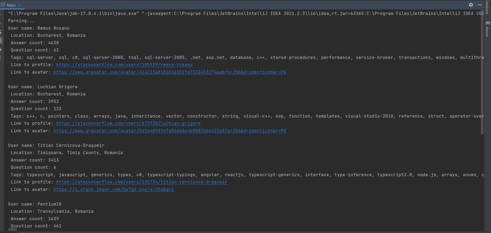

# Stack Overflow API parser

## Project description

An application that uses [Stack Overflow API](https://api.stackexchange.com/docs) to retrieve the list of stack overflow users(from 1 to 25 page) meeting
the following criteria:
1) Are located in Romania or Moldova;
2) Have a reputation of min 223 points;
3) Answered min 1 question;
4) Have the tags: "java", ".net", "docker", "C#"

It uses [Retrofit](https://square.github.io/retrofit/) to parse JSON format.

Project structure:
- Services - Application tier
- Model, DTO - Data tier
- Util - utility classes

## 💻 Technologies:

- JAVA 17
- Maven 3
- Retrofit 2.3.0
- Lombok 1.18.26
- JSON-converter 2.3.0

## How to run

- Clone this project from GitHub;
- mvn clean package - execute command in the project root folder
- java -jar target/stackoverflow-retrofit-parser-1.0-SNAPSHOT-jar-with-dependencies.jar - then execute this command to execute jar-file

## Execution result
